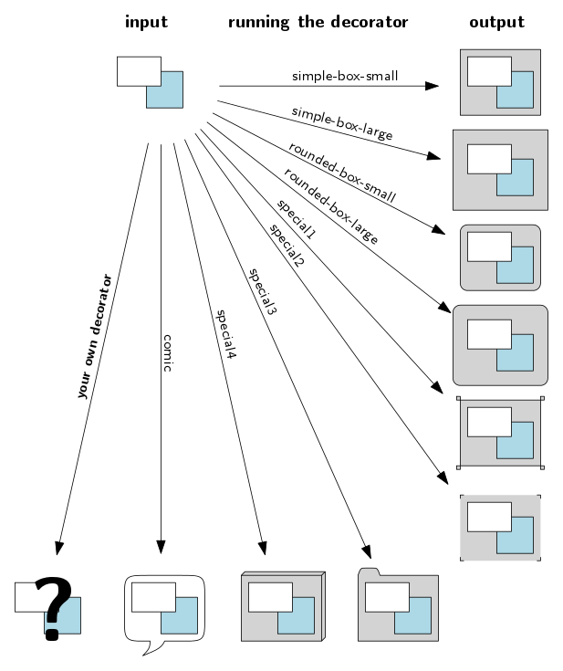

**Note:** Most of the functionality of this ipelet is built into Ipe
7.2.5 and higher.  See the provided stylesheet *decorations.isy* for
examples of how decorations are defined.  The built-in implementation
has the advantage that the decorations are resized automatically when
the object being decorated is changed.

With the decorator ipelet, you can decorate other objects (by for
example surrounding them with a box).  The ipelet is flexible in the
sense that you can define your own decorator objects.  The following
example ([Ipe file](decorator.ipe)) illustrates the usage.

 

# Download & Installation #

Download [decorator.lua](decorator.lua) and copy it to ~/.ipe/ipelets/
(or to some other directory for ipelets).

# Usage #

Run "Ipelets->Decorator->decorate" to decorate the currently selected objects.  For that to work, there must be decorator objects (symbols
with prefix "deco/") defined in your stylesheet (see the example
above).

# Creating Decorator Objects #

To create your own decorator object, execute the following steps.

1. Create a rectangle, lets call it R.
2. Create path objects, that decorate R (usually some kind of box around R).  You can use multiple objects for the decoration. 
3. Make sure that R is the front most object (select R and press Ctrl+F).
4. Group R together with the decoration (select R and the decoration and press Ctrl+G).
5. Run "Ipelets->Decorator->create deco-object".

Note that "Ipelets->Decorator->create deco-object" only slightly
extends "Ipelets->Symbols->create symbol" (it checks whether the
selected object can be used as decorator object and it automatically
adds the prefix "deco/").

# Changes #

**14. October 2014**
first version of the decorator ipelet online
